# BRIMS — Role Flowcharts

Barangay Resident Information Management System (Angular + Firestore).

**Start here:** Three **start terminal → end terminal** journeys below — one per role, top to bottom.

### Diagram files (visual)

| File | Description |
|------|-------------|
| [`brims-role-journeys.svg`](brims-role-journeys.svg) | **Overview** — Admin, Staff, Resident side by side (START → END) |
| [`brims-role-journeys.html`](brims-role-journeys.html) | **Interactive** — full Mermaid diagrams in browser (open locally) |
| [`diagrams/*.mmd`](diagrams/) | Mermaid source (edit & run `npm run docs:diagrams`) |

For module breakdowns and branches, see [Detailed reference](#detailed-reference) at the bottom.

---

## Admin journey — start to end

One session from opening the app until logout. Side branches rejoin the main line.

```mermaid
flowchart TB
  S([START — User opens BRIMS]) --> L1[/login — Login page/]
  L1 --> L2[Enter email + password]
  L2 --> L3{Valid input?}
  L3 -->|No| L2
  L3 -->|Yes| L4[AuthService.login → Firestore]
  L4 --> L5{Credentials OK?}
  L5 -->|No| L2
  L5 -->|Yes| L6[authGuard + roleGuard → role = Admin]
  L6 --> L7[/admin/dashboard — Admin dashboard/]

  L7 --> W1[Review stats · recent activity · notifications]
  W1 --> W2[/admin/requests — Open requests queue/]
  W2 --> W3[Select request → /admin/requests/:id]
  W3 --> W4{Pending or For Review?}
  W4 -->|Yes| W5{Approve or reject?}
  W5 -->|Approve| W6[Status → Approved · record approver]
  W5 -->|Reject| W7[Enter reason → Status → Rejected]
  W6 --> W8[Download certificate PDF/PNG · request QR]
  W7 --> W9[Request leaves active queue or archive later]
  W8 --> W9
  W4 -->|Already final| W9

  W9 --> W10{Archive this request? — Admin only}
  W10 -->|Yes| W11[/admin/archives — Tab Requests · restore later if needed/]
  W10 -->|No| W12
  W11 --> W12

  W12[/admin/residents — Residents list/]
  W12 --> W13{Add or edit?}
  W13 -->|Add| W14[/admin/residents/add — Create BRGY-#### · portal login/]
  W13 -->|Edit| W15[/admin/residents/:id — Profile · history · on-behalf request/]
  W14 --> W16
  W15 --> W16{Archive resident?}
  W16 -->|Yes| W17[/admin/archives — Tab Residents/]
  W16 -->|No| W18
  W17 --> W18

  W18[/admin/households — List · map · add · edit · detail/]
  W18 --> W19{Archive household?}
  W19 -->|Yes| W20[/admin/archives — Tab Households/]
  W19 -->|No| W21
  W20 --> W21

  W21[/admin/users — Users & Roles/]
  W21 --> W22[Add/edit Admin or Staff · roles · permissions]
  W22 --> W23{Archive staff account?}
  W23 -->|Yes| W24[/admin/archives — Tab Users/]
  W23 -->|No| W25
  W24 --> W25

  W25[/admin/sms · /admin/email — Broadcasts via backend/]
  W25 --> W26[/admin/audit-log — Review system actions/]
  W26 --> W27[/admin/reports — Charts · export PDF/]
  W27 --> W28[/admin/qr-scanner — Scan → open resident or request in new tab/]
  W28 --> W29[/admin/settings — System settings/]
  W29 --> W30[/admin/profile — My profile/]

  W30 --> X1[Profile menu → Logout]
  X1 --> X2{Confirm logout?}
  X2 -->|Cancel| W30
  X2 -->|Yes| X3[auth.logout — clear session · audit Logout]
  X3 --> X4[/login — Login page/]
  X4 --> E([END — Session ended])

  classDef startEnd fill:#4338ca,stroke:#312e81,color:#fff
  classDef route fill:#e0e7ff,stroke:#4338ca,color:#1e1b4b
  class S,E startEnd
  class L7,W2,W12,W18,W21,W25,W26,W27,W28,W29,W30,L1,X4 route
```

---

## Staff journey — start to end

Same core barangay work as Admin; **no** archive, Users & Roles, broadcast, audit, archives, or system settings.

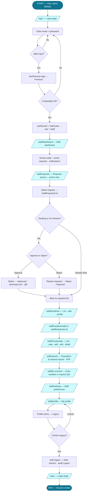

> **Note:** An Admin user can follow the same operational steps under `/staff/*` (guard allows Admin in staff area). Admin-only steps stay under `/admin/*` in the Admin journey above.

---

## Resident journey — start to end

From login through requesting a certificate, tracking the outcome, then logout.

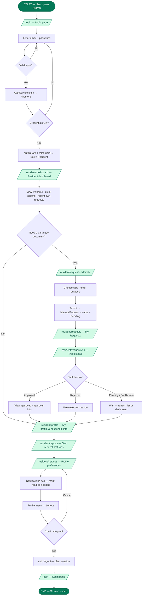

---

## Public path — forgot password (any role)

Separate entry that also ends at the login terminal.

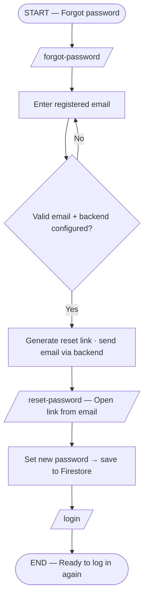

---

## Role comparison — same terminals, different middle

| Phase | Admin | Staff | Resident |
|-------|-------|-------|----------|
| **Start** | Open BRIMS | Open BRIMS | Open BRIMS |
| **Login terminal** | `/login` → Firestore → `/admin/dashboard` | `/login` → `/staff/dashboard` | `/login` → `/resident/dashboard` |
| **Core work** | Requests + residents + households + **governance** | Requests + residents + households + reports + QR | Request certificate + track **own** requests |
| **Admin-only middle** | Archive · Users · SMS/Email · Audit · Settings | — | — |
| **End** | Logout → `/login` → session cleared | Same | Same |

---

<a id="detailed-reference"></a>

# Detailed reference (modules & branches)

The sections below break out authentication, archives, QR parsing, and permission tables. Use the **start → end** journeys above for the full role path; use this section when you need step detail on one module.

---

## §1 Authentication & access

### 1.1 Login and portal routing

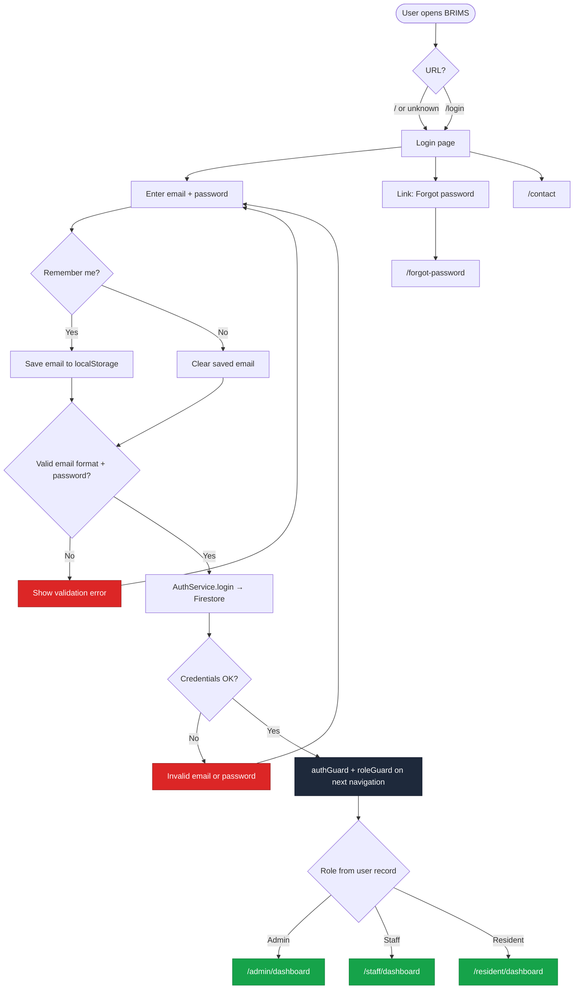

### 1.2 Forgot / reset password

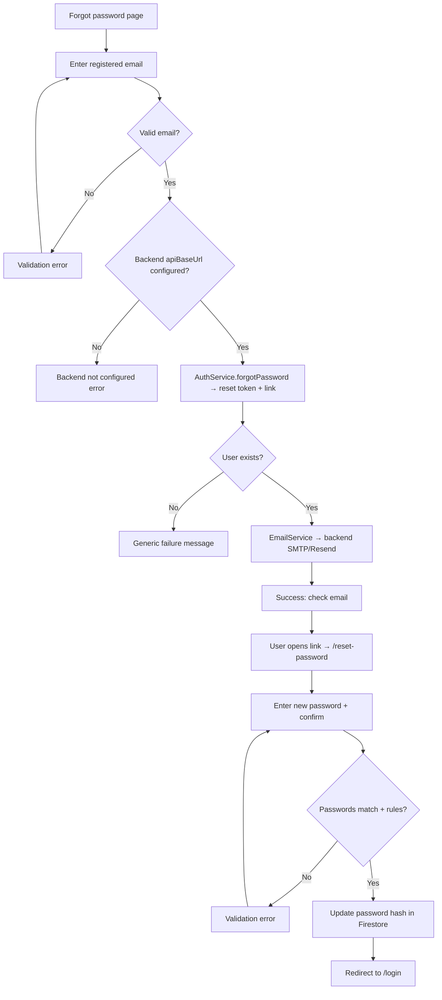

### 1.3 Route protection (every protected page)

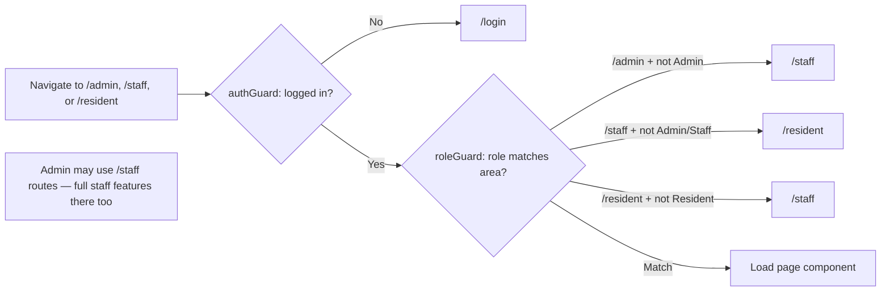

---

## §2 Admin portal (`/admin`) — detailed

### 2.1 Admin navigation map

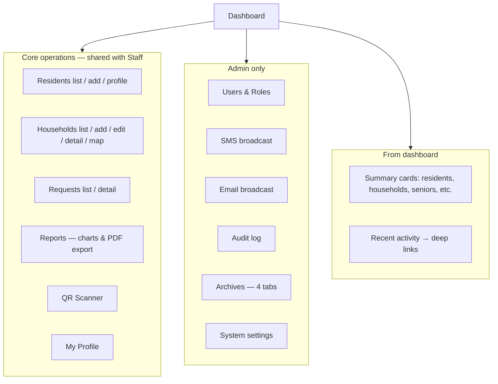

### 2.2 Admin — Users & Roles

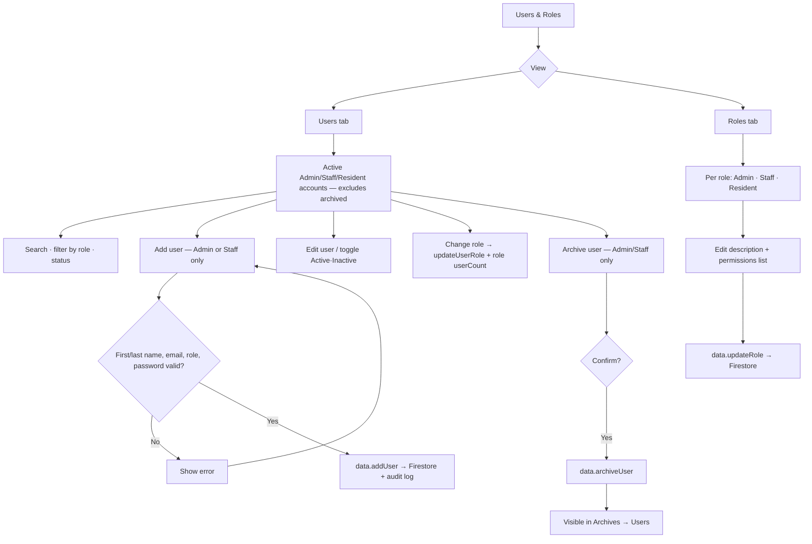

### 2.3 Admin — Archives (restore)

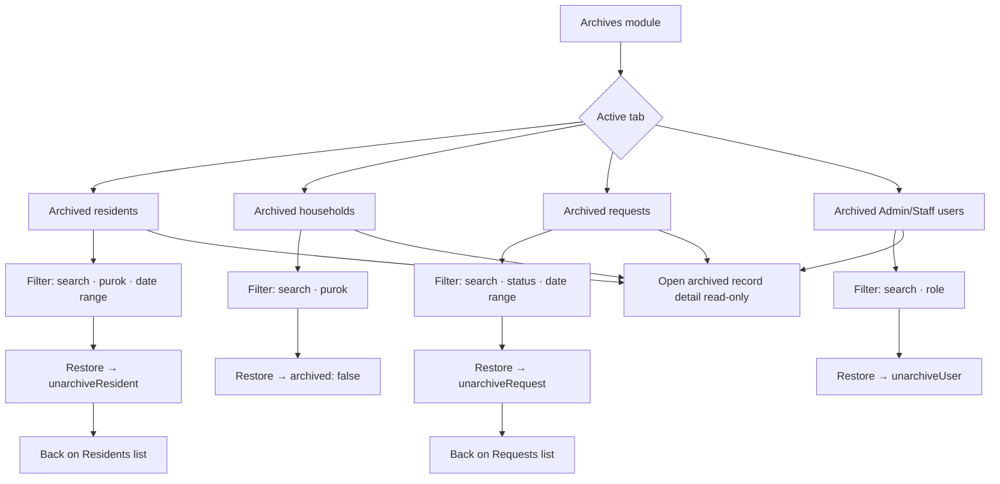

### 2.4 Admin — SMS & email broadcast

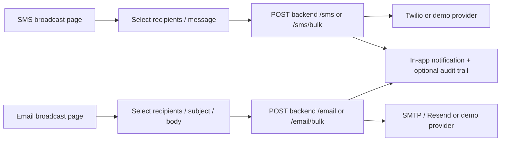

### 2.5 Admin — exclusive archive actions (from live lists)

| Source page | Action | Who | Result |
|-------------|--------|-----|--------|
| Residents list | Archive resident (single/bulk) | Admin only | Hidden from main list → Archives tab |
| Households list | Archive household (bulk) | Admin only | Same |
| Requests list | Archive request (single/bulk) | Admin only | Warns if not Approved/Rejected |
| Users & Roles | Archive Admin/Staff account | Admin only | Archives → Users tab |

Staff **cannot** archive; Staff **cannot** open Archives, Users & Roles, SMS/Email, Audit Log, or system Settings.

---

## §3 Staff portal (`/staff`) — detailed

### 3.1 Staff vs Admin (same core, different ceiling)

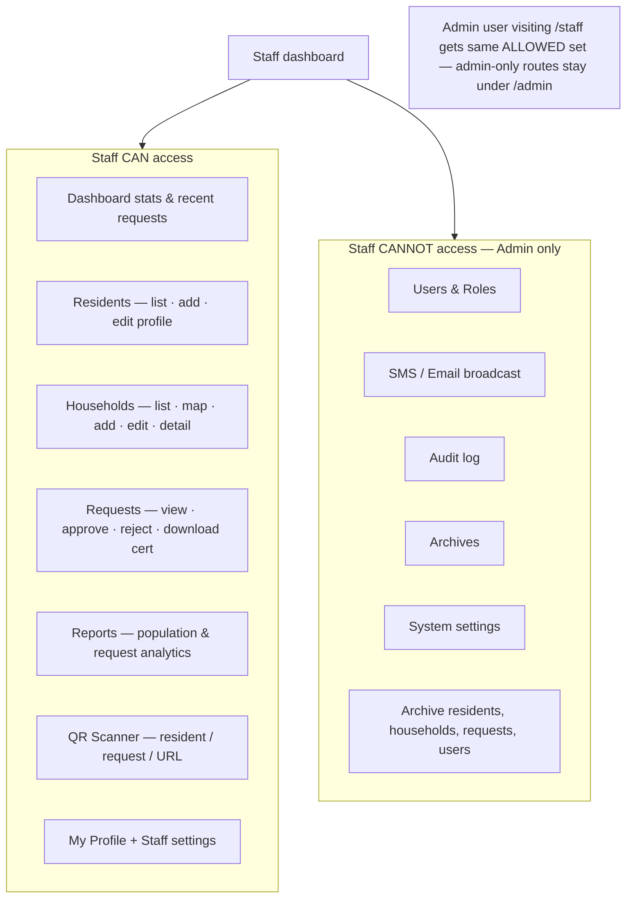

### 3.2 Staff daily loop (typical)

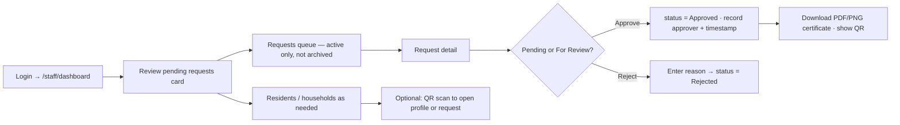

---

## §4 Resident portal (`/resident`) — detailed

### 4.1 Resident navigation & data scope

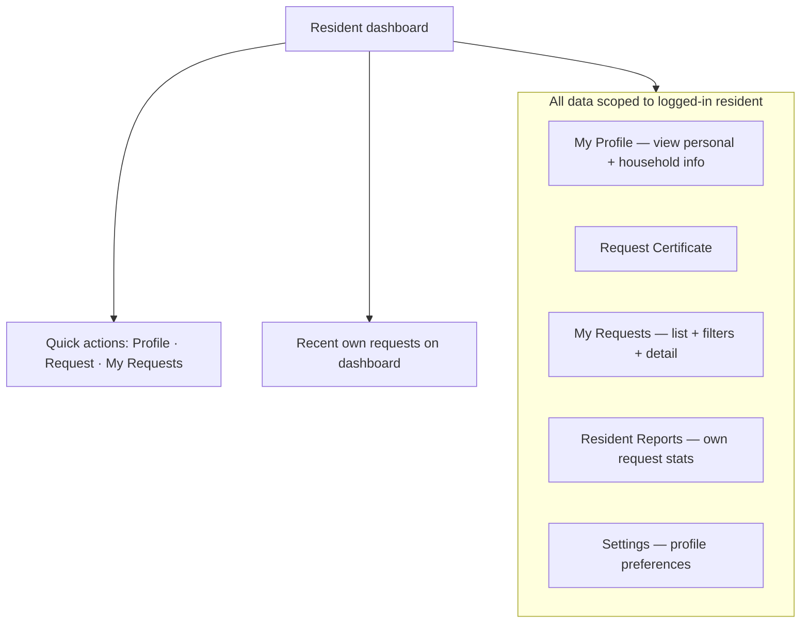

### 4.2 Resident — request certificate (step by step)

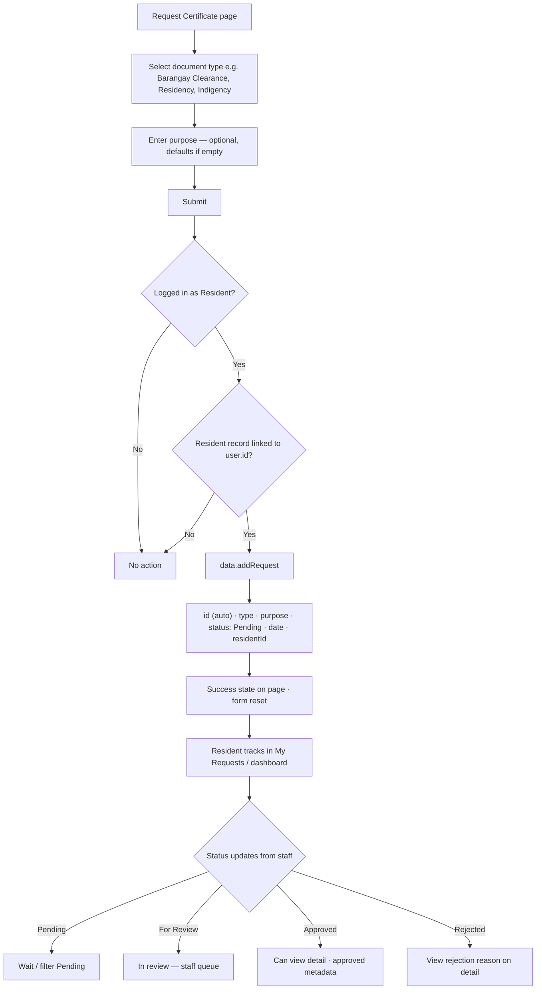

### 4.3 Resident — My Requests detail

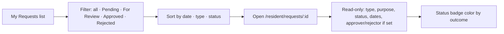

Residents **cannot** approve, archive, edit other residents, or access staff/admin routes (roleGuard redirects to `/staff` if they try).

---

## §5 Certificate request lifecycle (full detail)

### 5.1 End-to-end (all roles)

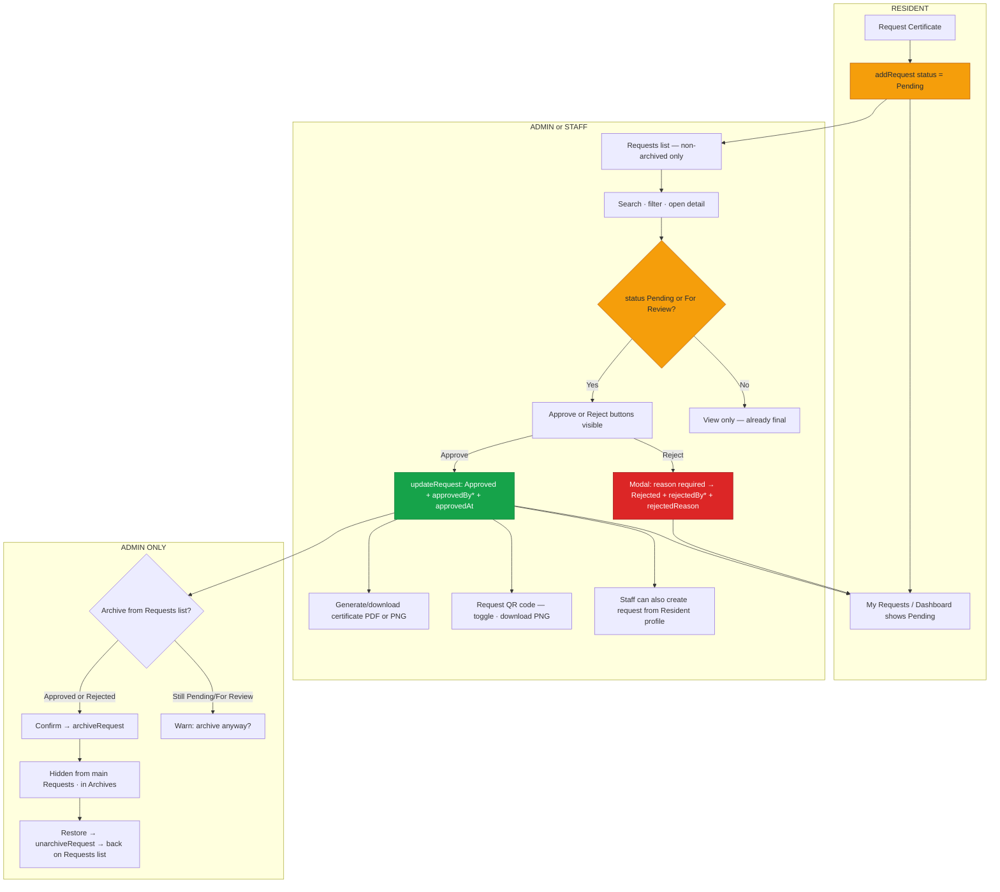

### 5.2 Request status state machine

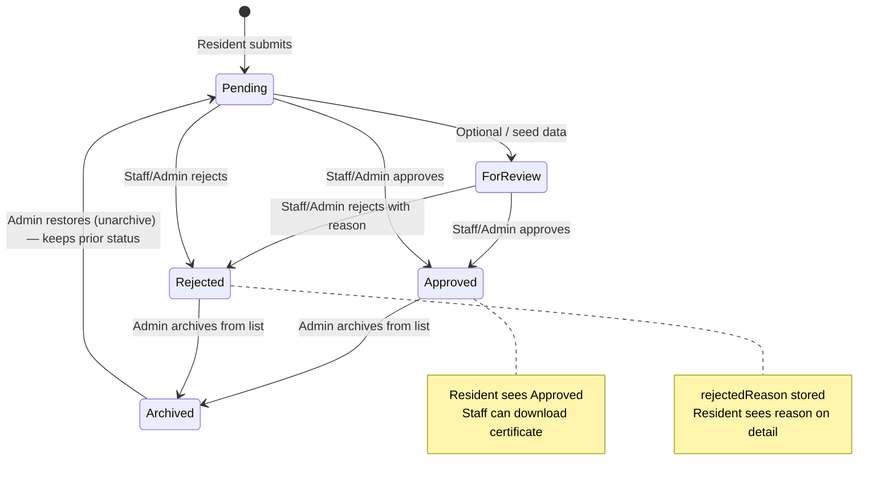

---

## §6 Resident records (Admin & Staff)

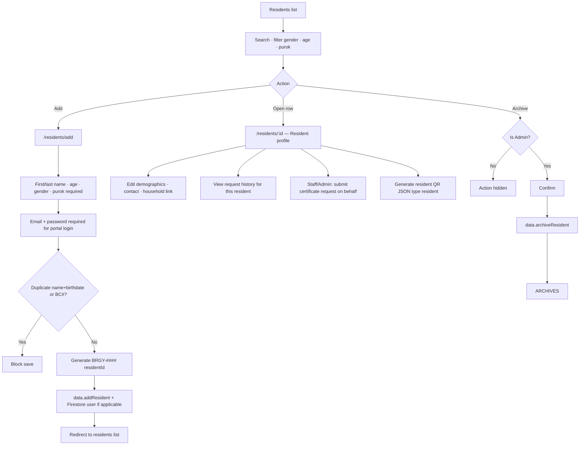

---

## §7 Household records (Admin & Staff)

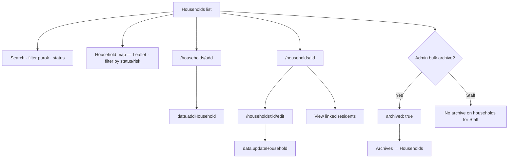

---

## §8 QR Scanner (Admin & Staff)

```mermaid
flowchart TB
  QR[QR Scanner page] --> CAM[Request camera permission]
  CAM --> PERM{Granted?}
  PERM -->|No| ERR[Show permission / device error · Retry]
  PERM -->|Yes| SCAN[ZXing scan QR_CODE format]

  SCAN --> PARSE{Parse payload}
  PARSE -->|JSON type resident| RES["Open /admin|staff/residents/:id in new tab"]
  PARSE -->|JSON type request or certificate| REQ["Open /admin|staff/requests/:id in new tab"]
  PARSE -->|URL http(s)| EXT[Open URL in new tab]
  PARSE -->|REQ- prefix or raw id| REQ
  PARSE -->|Known resident id| RES
  PARSE -->|Unknown format| FAIL[Unrecognized QR error]

  SCAN --> AGAIN[Reset scanner → scan next code]
```

---

## §9 Reports (Admin & Staff vs Resident)

```mermaid
flowchart LR
  subgraph STAFF_REP["/admin|staff/reports"]
    SR1[Load active non-archived residents & households]
    SR2[Request stats: Pending · For Review · Approved · Rejected]
    SR3[Charts: Chart.js — age/sex, purok, request types]
    SR4[Export PDF reports]
  end

  subgraph RES_REP["/resident/reports"]
    RR1[Only current resident's requests]
    RR2[Counts by status · simple charts]
  end
```

---

## §10 Notifications (cross-cutting)

```mermaid
flowchart LR
  BELL[Notification bell — top bar] --> PANEL[Slide-out panel]
  PANEL --> READ[Mark one read · Mark all read]

  EVT[System events] --> LOCAL[In-app NotificationService]
  EVT --> FS[Firestore portalNotifications — cross-device for staff/resident]

  HIDE[Hidden on: login · forgot/reset password · settings · QR scanner · household map fullscreen · some detail pages]
```

---

## §11 Permission matrix (detailed)

| Action | Admin | Staff | Resident |
|--------|:-----:|:-----:|:--------:|
| Login to own portal | ✓ `/admin` | ✓ `/staff` | ✓ `/resident` |
| Dashboard & profile | ✓ | ✓ | ✓ |
| List/add/edit residents | ✓ | ✓ | — |
| Archive residents | ✓ | — | — |
| List/add/edit households & map | ✓ | ✓ | — |
| Archive households | ✓ | — | — |
| View/process certificate requests | ✓ | ✓ | — |
| Approve / reject requests | ✓ | ✓ | — |
| Archive requests | ✓ | — | — |
| Download certificate / request QR | ✓ | ✓ | — (own view only on resident detail) |
| QR scanner | ✓ | ✓ | — |
| Staff reports & PDF export | ✓ | ✓ | — |
| Request certificate (self) | — | — | ✓ |
| View own requests & resident reports | — | — | ✓ |
| Manage users & roles | ✓ | — | — |
| SMS / email broadcast | ✓ | — | — |
| Audit log | ✓ | — | — |
| Archives & restore | ✓ | — | — |
| System settings | ✓ | — | — |
| Staff settings | ✓ | ✓ | ✓ (resident settings) |

---

## Route quick reference

| Area | Base path | Auth |
|------|-----------|------|
| Login | `/login` | Public |
| Forgot / reset | `/forgot-password`, `/reset-password` | Public |
| Admin | `/admin/*` | Admin only |
| Staff | `/staff/*` | Admin or Staff |
| Resident | `/resident/*` | Resident only |

*Generated from `app.routes.ts`, guards, and page components in the BRIMS codebase.*
