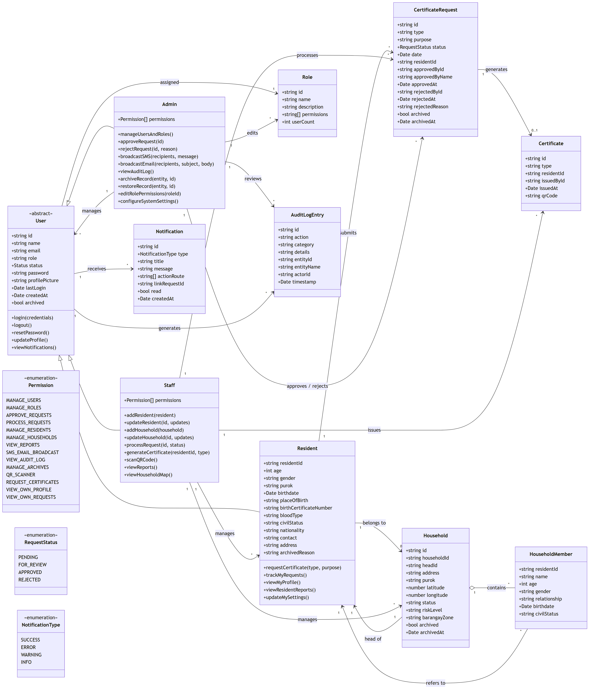

# BRIMS – Class Diagram by Roles

UML class diagram for the **Barangay Resident Information Management System (BRIMS)**, organized around the three primary user roles (**Admin**, **Staff**, **Resident**) and the domain entities they interact with.



## How to read this diagram

- **`User`** is an abstract base class capturing fields and behavior common to every account (login, logout, profile, notifications). It maps to the `SystemUser` interface in [`src/app/services/data.service.ts`](../src/app/services/data.service.ts).
- **`Admin`**, **`Staff`**, and **`Resident`** all inherit from `User` and add **role-specific operations** (the methods listed inside each class).
- **`Resident`** plays a dual purpose in BRIMS: it is both a *login account* (for the Resident portal) **and** a *domain record* (the `Resident` interface), which is why it owns descriptive fields like `purok`, `birthdate`, and `bloodType` in addition to inheriting the auth fields from `User`.
- **`Role`** + **`Permission`** model BRIMS' role-based access control. Each `User` has exactly one `Role`, and each `Role` carries a set of `Permission`s — these mirror the permission lists you can edit under **Admin → Users & Roles**.
- **Domain entities** (`CertificateRequest`, `Household`, `HouseholdMember`, `AuditLogEntry`, `Notification`, `Certificate`) sit on the right. Associations show which roles **create**, **process**, **approve**, or **review** each entity.

## Role responsibilities at a glance

### Admin (`Admin`)
**Inherits:** all `Staff` methods + everything below.
- `manageUsersAndRoles()` – add/edit/archive Admin & Staff accounts; edit role descriptions & permissions.
- `approveRequest(id)` / `rejectRequest(id, reason)` – final decisions on certificate requests.
- `broadcastSMS()` / `broadcastEmail()` – outbound communications via Twilio and SMTP.
- `viewAuditLog()` – traceability over all key actions.
- `archiveRecord()` / `restoreRecord()` – soft-archive of residents, households, requests, users.
- `configureSystemSettings()` – global preferences.

### Staff (`Staff`)
Day-to-day barangay operations.
- `addResident()` / `updateResident()` – CRUD on the resident registry.
- `addHousehold()` / `updateHousehold()` – CRUD on households (including `latitude`/`longitude` for the map view).
- `processRequest(id, status)` – move certificate requests through their lifecycle (Pending → For Review → Approved/Rejected by Admin).
- `generateCertificate(residentId, type)` – emit residency, indigency, etc.
- `scanQRCode()` – open a resident / request / certificate from a QR code.
- `viewReports()` / `viewHouseholdMap()` – population, demographics, and geographic views.

### Resident (`Resident`)
Self-service portal.
- `requestCertificate(type, purpose)` – submit new requests (becomes a `CertificateRequest` with `status = PENDING`).
- `trackMyRequests()` – browse own request history with statuses.
- `viewMyProfile()` – read personal + household info.
- `viewResidentReports()` – reports filtered to the logged-in resident.
- `updateMySettings()` – preferences and profile basics.

## Key associations

| From | To | Meaning |
|------|----|---------|
| `Resident` → `Household` (0..1) | belongs to | A resident may be a member of at most one active household. |
| `Household` → `HouseholdMember` (1..*) | contains (composition) | Members are an inseparable part of the household record. |
| `Household` → `Resident` (1) | head of | The household's `headId` references the head-of-family resident. |
| `Resident` → `CertificateRequest` (1..*) | submits | Residents create new requests. |
| `Staff` → `CertificateRequest` (1..*) | processes | Staff move requests through statuses. |
| `Admin` → `CertificateRequest` (1..*) | approves / rejects | Admin makes the final decision. |
| `CertificateRequest` → `Certificate` (0..1) | generates | An approved request produces a certificate. |
| `Admin` → `User` (1..*) | manages | Admin can create/archive Admin & Staff users. |
| `Admin` → `Role` (1..*) | edits | Admin can edit role descriptions & permissions. |
| `User` → `Notification` (1..*) | receives | All users see in-app notifications. |
| `User` → `AuditLogEntry` (1..*) | generates | Every key action is logged. |

## Enumerations

- **`RequestStatus`** — `PENDING`, `FOR_REVIEW`, `APPROVED`, `REJECTED`
- **`NotificationType`** — `SUCCESS`, `ERROR`, `WARNING`, `INFO`
- **`Permission`** — `MANAGE_USERS`, `MANAGE_ROLES`, `APPROVE_REQUESTS`, `PROCESS_REQUESTS`, `MANAGE_RESIDENTS`, `MANAGE_HOUSEHOLDS`, `VIEW_REPORTS`, `SMS_EMAIL_BROADCAST`, `VIEW_AUDIT_LOG`, `MANAGE_ARCHIVES`, `QR_SCANNER`, `REQUEST_CERTIFICATES`, `VIEW_OWN_PROFILE`, `VIEW_OWN_REQUESTS`

## Source

The diagram is generated from the Mermaid source [`brims-class-diagram-by-roles.mmd`](./brims-class-diagram-by-roles.mmd).

### Re-render

```bash
npx -p @mermaid-js/mermaid-cli mmdc \
  -i docs/brims-class-diagram-by-roles.mmd \
  -o docs/brims-class-diagram-by-roles.png \
  -b white -w 3200 -H 2400 --scale 2
```
