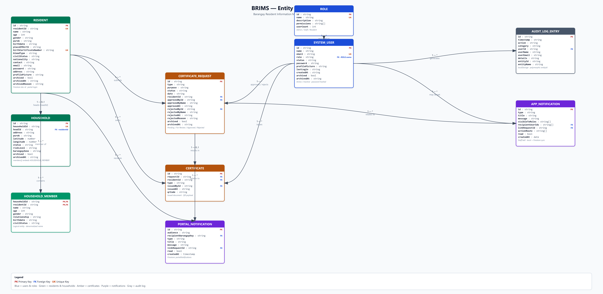

# BRIMS – Entity Relationship Diagram (ERD)

Updated ERD for the **Barangay Resident Information Management System (BRIMS)**, derived directly from the TypeScript interfaces in [`src/app/services/*.ts`](../src/app/services).



## Entities

### Core domain

| Entity | Description | Source |
|--------|-------------|--------|
| **RESIDENT** | Person registered in the barangay; also acts as the login record for the Resident portal. | `Resident` in `data.service.ts` |
| **HOUSEHOLD** | A household with address, purok, optional GIS coordinates, and risk metadata. | `Household` in `data.service.ts` |
| **HOUSEHOLD_MEMBER** | Join entity between a household and its resident members (denormalized name/age cached for fast list rendering). | `HouseholdMember` in `data.service.ts` |
| **CERTIFICATE_REQUEST** | A request for a barangay document (residency, indigency, clearance, etc.). Tracks both approval and rejection. | `CertificateRequest` in `data.service.ts` |
| **CERTIFICATE** | The generated certificate that results from an approved request. | Produced by `certificate-generator.service.ts` + QR via `qr-code.service.ts` |

### Identity & access

| Entity | Description | Source |
|--------|-------------|--------|
| **SYSTEM_USER** | Admin / Staff / Resident login account. | `SystemUser` in `data.service.ts` |
| **ROLE** | Role definition with a list of `permissions` and a cached `userCount`. | `Role` in `data.service.ts` |

### Cross-cutting

| Entity | Description | Source |
|--------|-------------|--------|
| **AUDIT_LOG_ENTRY** | Append-only log of key actions across the system. | `AuditLogEntry` in `audit-log.service.ts` |
| **PORTAL_NOTIFICATION** | Firestore-backed notification rows shown in the staff/resident bell across devices. | `PortalNotificationRow` in `firestore-portal-notifications.service.ts` |
| **APP_NOTIFICATION** | In-app (per-session) notifications routed by role and/or user id. | `AppNotification` in `notification.service.ts` |

## Key relationships

| Relationship | Cardinality | Notes |
|--------------|-------------|-------|
| `RESIDENT` heads `HOUSEHOLD` | 1 — 0..1 | `Household.headId` points to a single resident's barangay id. |
| `HOUSEHOLD` contains `HOUSEHOLD_MEMBER` | 1 — 0..* | Composition; members are owned by the household record. |
| `RESIDENT` appears as `HOUSEHOLD_MEMBER` | 1 — 0..* | Same resident is referenced via `HouseholdMember.residentId`. |
| `RESIDENT` submits `CERTIFICATE_REQUEST` | 1 — 0..* | Requests carry the resident's barangay id. |
| `CERTIFICATE_REQUEST` yields `CERTIFICATE` | 1 — 0..1 | A certificate is only issued after the request is approved. |
| `SYSTEM_USER` approves / rejects `CERTIFICATE_REQUEST` | 1 — 0..* | Captured in `approvedById`, `approvedByName`, `approvedAt` (and the matching rejection fields). |
| `ROLE` assigned to `SYSTEM_USER` | 1 — 0..* | Role is referenced by name; `Role.permissions` drives feature access. |
| `SYSTEM_USER` generates `AUDIT_LOG_ENTRY` | 1 — 0..* | Every key action is logged with actor info. |
| `SYSTEM_USER` / `RESIDENT` receives `PORTAL_NOTIFICATION` | 1 — 0..* | `audience = 'staff'` (System Users) vs `audience = 'resident'` (matched by `recipientBarangayKey`). |
| `CERTIFICATE_REQUEST` is linked to `PORTAL_NOTIFICATION` / `APP_NOTIFICATION` | 1 — 0..* | Via `linkRequestId` for click-through into the request detail. |

## Notes on data model design

- **Two id fields on Resident.** `id` is the Firestore document id; `residentId` is the human-readable barangay id (e.g. `BRGY-1001`) used in foreign keys (`Household.headId`, `HouseholdMember.residentId`, `CertificateRequest.residentId`, `PortalNotification.recipientBarangayKey`). This makes barangay-id references stable even if the underlying document is migrated.
- **Soft-archive flags** (`archived`, `archivedAt`, and sometimes `archivedReason`) appear on `Resident`, `Household`, `CertificateRequest`, and `SystemUser`. They drive the **Archives** module and let admins restore records without losing audit history.
- **Denormalized fields** are intentional: `approvedByName` / `rejectedByName` on requests, and `name` / `age` on household members, are cached so list screens render without joining.
- **Polymorphic audit references.** `AuditLogEntry.entityId` / `entityName` are not strict foreign keys — they vary by `category` (resident / household / user / role / request / system / auth).
- **Two notification stores.** `PortalNotification` is Firestore-persisted (cross-device, multi-user); `AppNotification` is per-session (in-memory + `localStorage`) and can route by role or specific user ids.

## Source

Generated from [`brims-erd.mmd`](./brims-erd.mmd).

### Re-render

```bash
npx -p @mermaid-js/mermaid-cli mmdc \
  -i docs/brims-erd.mmd \
  -o docs/brims-erd.png \
  -b white -w 3200 -H 2400 --scale 2
```
