# BRIMS – Use Case Diagram

Use case diagram for the **Barangay Resident Information Management System (BRIMS)**.

## Actors

| Actor | Type | Description |
|-------|------|-------------|
| **Admin** | Primary | Full system access, including user management, broadcasts, audit log, and archives. |
| **Staff** | Primary | Day-to-day barangay operations: residents, households, requests, reports. |
| **Resident** | Primary | Self-service portal: profile, certificate requests, reports. |
| **Twilio** | External | SMS delivery provider for broadcasts and notifications. |
| **SMTP Server** | External | Email delivery provider (via Nodemailer). |
| **Firebase / Firestore** | External | Primary datastore for all persistent data. |

## Diagram

```mermaid
flowchart LR
  %% ===== Actors =====
  Admin(["👤 Admin"]):::actor
  Staff(["👤 Staff"]):::actor
  Resident(["👤 Resident"]):::actor
  Twilio(["☁ Twilio (SMS)"]):::ext
  SMTP(["☁ SMTP Server (Email)"]):::ext
  Firestore(["☁ Firebase / Firestore"]):::ext

  %% ===== System Boundary =====
  subgraph BRIMS["BRIMS — Barangay Resident Information Management System"]
    direction TB

    subgraph AUTH["Authentication"]
      UC_Login(("Login"))
      UC_Forgot(("Forgot / Reset Password"))
      UC_Logout(("Logout"))
    end

    subgraph COMMON["Cross-cutting"]
      UC_Notif(("View / Read In-App Notifications"))
      UC_AuthZ(("Enforce Role-Based Access"))
    end

    subgraph RES["Resident Portal"]
      UC_ResDash(("View Resident Dashboard"))
      UC_MyProfile(("View My Profile"))
      UC_ReqCert(("Request Certificate"))
      UC_MyReq(("Track My Requests"))
      UC_ResRep(("View Resident Reports"))
      UC_ResSet(("Update Profile / Settings"))
    end

    subgraph STAFFOPS["Staff Operations (Admin + Staff)"]
      UC_StaffDash(("View Staff Dashboard"))
      UC_QR(("Scan QR Code"))
      UC_MgResidents(("Manage Residents"))
      UC_MgHouseholds(("Manage Households"))
      UC_MapView(("View Household Map"))
      UC_Reports(("View Reports"))
      UC_ProcessReq(("Process Certificate Request"))
      UC_GenCert(("Generate Certificate"))
    end

    subgraph ADMINONLY["Admin-Only"]
      UC_Approve(("Approve Requests"))
      UC_Users(("Manage Users & Roles"))
      UC_SMS(("Broadcast SMS"))
      UC_Email(("Broadcast Email"))
      UC_Audit(("View Audit Log"))
      UC_Archive(("Archive Records"))
      UC_Restore(("Restore Archived Records"))
      UC_Settings(("System Settings"))
    end
  end

  %% ===== Resident associations =====
  Resident --> UC_Login
  Resident --> UC_Forgot
  Resident --> UC_Logout
  Resident --> UC_ResDash
  Resident --> UC_MyProfile
  Resident --> UC_ReqCert
  Resident --> UC_MyReq
  Resident --> UC_ResRep
  Resident --> UC_ResSet
  Resident --> UC_Notif

  %% ===== Staff associations =====
  Staff --> UC_Login
  Staff --> UC_Forgot
  Staff --> UC_Logout
  Staff --> UC_StaffDash
  Staff --> UC_QR
  Staff --> UC_MgResidents
  Staff --> UC_MgHouseholds
  Staff --> UC_MapView
  Staff --> UC_Reports
  Staff --> UC_ProcessReq
  Staff --> UC_GenCert
  Staff --> UC_Notif

  %% ===== Admin associations (inherits Staff capabilities) =====
  Admin --> UC_Login
  Admin --> UC_Forgot
  Admin --> UC_Logout
  Admin --> UC_StaffDash
  Admin --> UC_QR
  Admin --> UC_MgResidents
  Admin --> UC_MgHouseholds
  Admin --> UC_MapView
  Admin --> UC_Reports
  Admin --> UC_ProcessReq
  Admin --> UC_GenCert
  Admin --> UC_Approve
  Admin --> UC_Users
  Admin --> UC_SMS
  Admin --> UC_Email
  Admin --> UC_Audit
  Admin --> UC_Archive
  Admin --> UC_Restore
  Admin --> UC_Settings
  Admin --> UC_Notif

  %% ===== Includes / Extends =====
  UC_Login -. include .-> UC_AuthZ
  UC_ProcessReq -. include .-> UC_GenCert
  UC_ProcessReq -. extend .-> UC_Approve
  UC_ReqCert -. triggers .-> UC_Notif
  UC_ProcessReq -. triggers .-> UC_Notif

  %% ===== External system relationships =====
  UC_SMS --> Twilio
  UC_Email --> SMTP
  BRIMS --- Firestore

  classDef actor fill:#e3f2fd,stroke:#1565c0,stroke-width:1.5px,color:#0d47a1;
  classDef ext fill:#fff3e0,stroke:#ef6c00,stroke-width:1.5px,color:#e65100;
```

## Use Cases by Actor

### Resident
- **Login / Logout / Forgot Password** – Standard account access flows.
- **View Resident Dashboard** – Welcome screen with quick actions.
- **View My Profile** – Read personal and household information.
- **Request Certificate** – Submit a new document/certificate request.
- **Track My Requests** – View list and statuses of submitted requests.
- **View Resident Reports** – Reports relevant to the logged-in resident.
- **Update Profile / Settings** – Edit own profile and preferences.
- **View / Read Notifications** – In-app notification bell and panel.

### Staff (shared with Admin)
- **View Staff Dashboard** – Operational summary and quick navigation.
- **Scan QR Code** – Open resident/request/certificate from QR scan.
- **Manage Residents** – List, search, filter, add, edit, view profiles.
- **Manage Households** – List, add, edit, view household details.
- **View Household Map** – Geographic visualization (Leaflet).
- **View Reports** – Population, household, demographic breakdowns.
- **Process Certificate Request** – Review and act on resident requests.
- **Generate Certificate** – Produce residency/indigency/etc. documents.

### Admin (in addition to Staff capabilities)
- **Approve Requests** – Final approval for certificate requests.
- **Manage Users & Roles** – CRUD on Admin/Staff accounts, edit role permissions.
- **Broadcast SMS** – Send single and bulk SMS via Twilio.
- **Broadcast Email** – Send single and bulk email via SMTP.
- **View Audit Log** – Track key actions across the system.
- **Archive Records** – Move residents, households, requests, or accounts to Archives.
- **Restore Archived Records** – Reactivate items from the Archives module.
- **System Settings** – Application-wide preferences and configuration.

## Key Relationships

- **`«include»`** – `Login` always **includes** `Enforce Role-Based Access` (route guards).
- **`«include»`** – `Process Certificate Request` **includes** `Generate Certificate` when a request is fulfilled.
- **`«extend»`** – `Approve Requests` **extends** `Process Certificate Request` for Admin-only approval flows.
- **Trigger** – `Request Certificate` and `Process Certificate Request` trigger in-app notifications and may invoke `Broadcast SMS` / `Broadcast Email`.
- **External** – `Broadcast SMS` uses **Twilio**, `Broadcast Email` uses **SMTP**, and all persistence flows through **Firebase / Firestore**.
