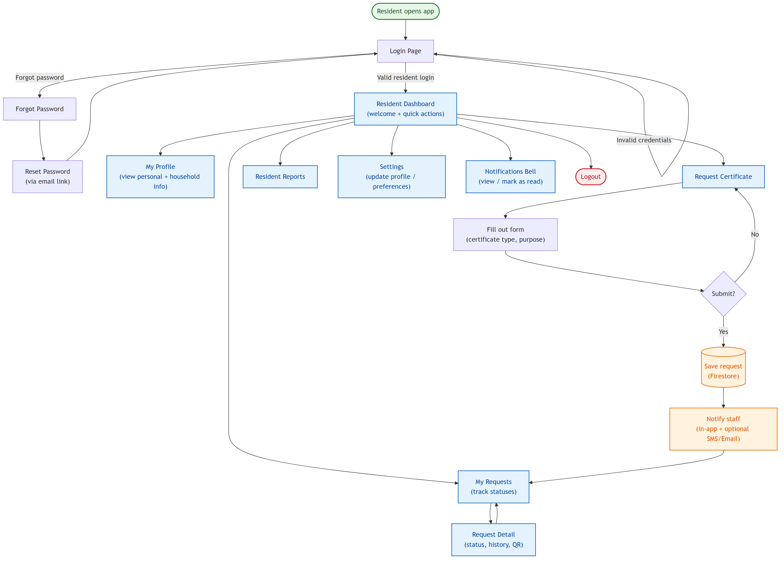
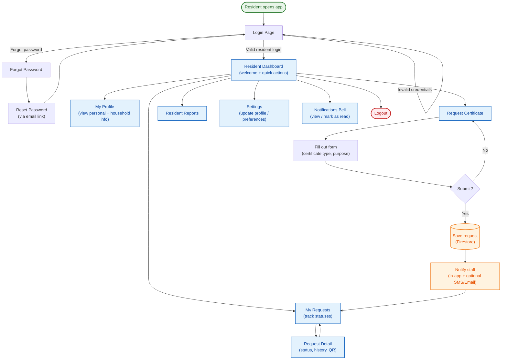
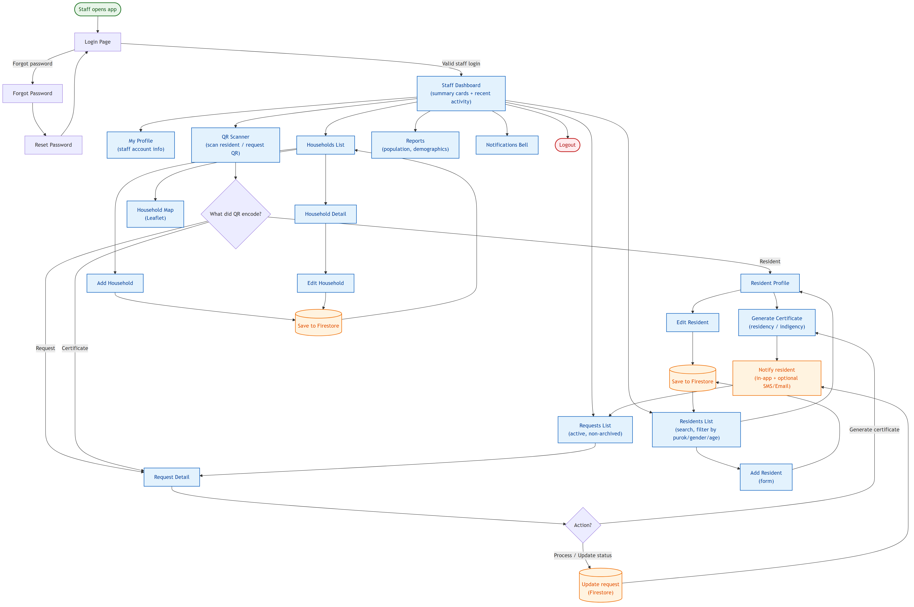
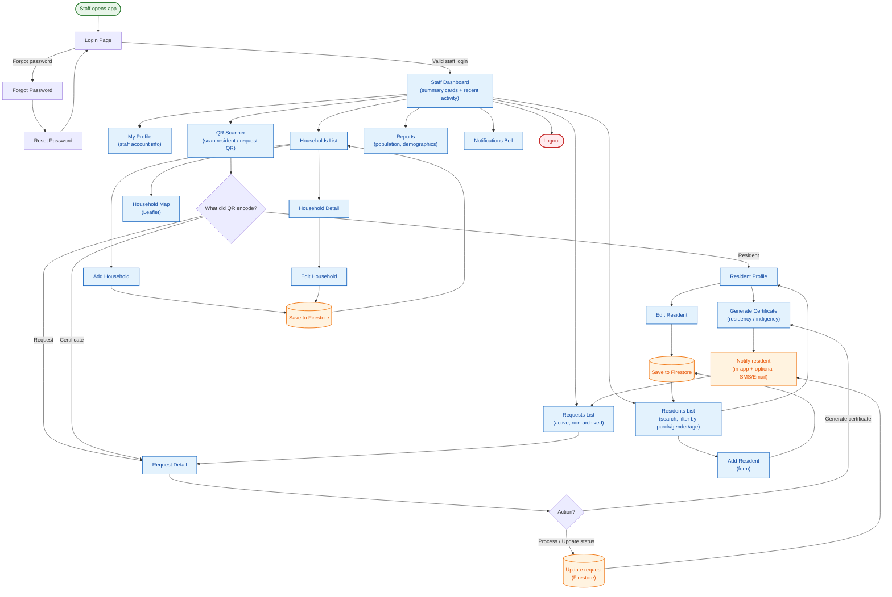
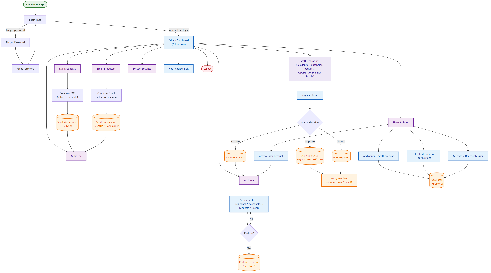
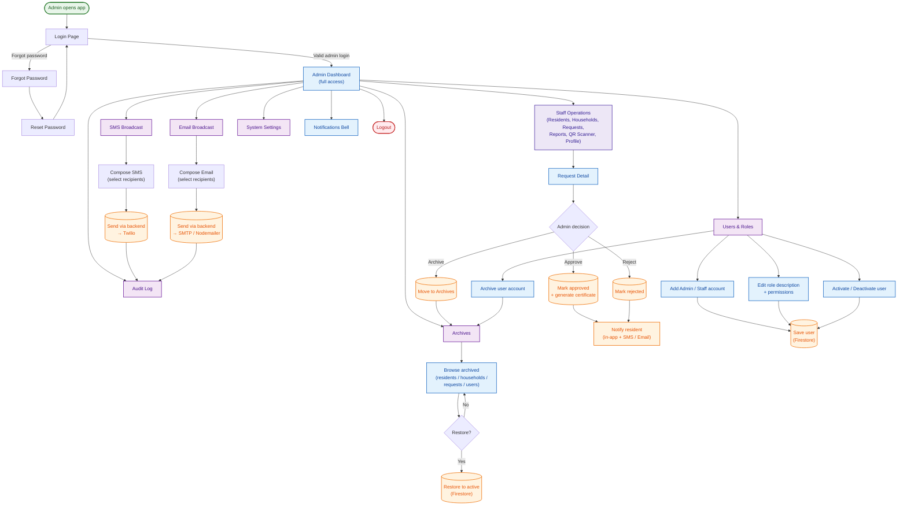

# BRIMS – User Flowcharts (by Role)

End-to-end navigation and action flows for each user role in the **Barangay Resident Information Management System (BRIMS)**.

| Role | Source | PNG |
|------|--------|-----|
| Resident | [`brims-flow-resident.mmd`](./brims-flow-resident.mmd) | [`brims-flow-resident.png`](./brims-flow-resident.png) |
| Staff | [`brims-flow-staff.mmd`](./brims-flow-staff.mmd) | [`brims-flow-staff.png`](./brims-flow-staff.png) |
| Admin | [`brims-flow-admin.mmd`](./brims-flow-admin.mmd) | [`brims-flow-admin.png`](./brims-flow-admin.png) |

**Legend**

- 🟢 **Green stadium** = Start of flow
- 🔴 **Red stadium** = Logout / end of flow
- 🔵 **Blue box** = App page / screen
- 🟣 **Purple box** = Admin-only feature
- 🟠 **Orange cylinder** = External system action (Firestore write, Twilio, SMTP)
- ◇ **Diamond** = Decision point

---

## 1. Resident Flow

A logged-in resident's journey: profile, certificate requests, tracking, reports, and settings.





---

## 2. Staff Flow

Day-to-day barangay staff operations: residents, households, requests, reports, and the QR scanner.





---

## 3. Admin Flow

Admin inherits all Staff capabilities plus admin-only features: Users & Roles, broadcasts, audit log, archives, approvals, and system settings.





---

## Re-rendering

To regenerate the PNGs after editing the `.mmd` source files:

```bash
npx -p @mermaid-js/mermaid-cli mmdc -i docs/brims-flow-resident.mmd -o docs/brims-flow-resident.png -b white -w 1800 -H 2400 --scale 2
npx -p @mermaid-js/mermaid-cli mmdc -i docs/brims-flow-staff.mmd    -o docs/brims-flow-staff.png    -b white -w 2400 -H 2400 --scale 2
npx -p @mermaid-js/mermaid-cli mmdc -i docs/brims-flow-admin.mmd    -o docs/brims-flow-admin.png    -b white -w 2400 -H 2400 --scale 2
```
